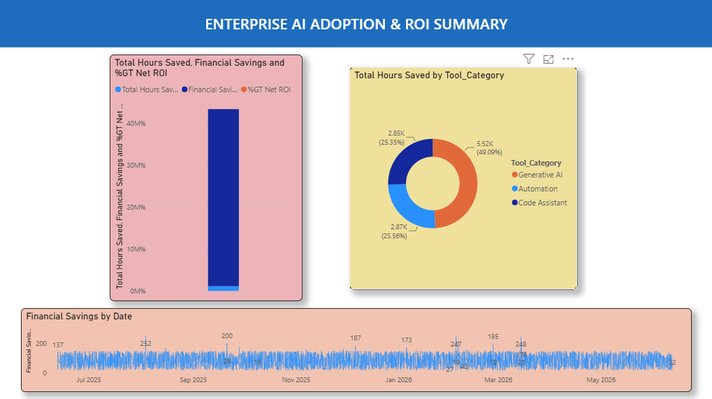
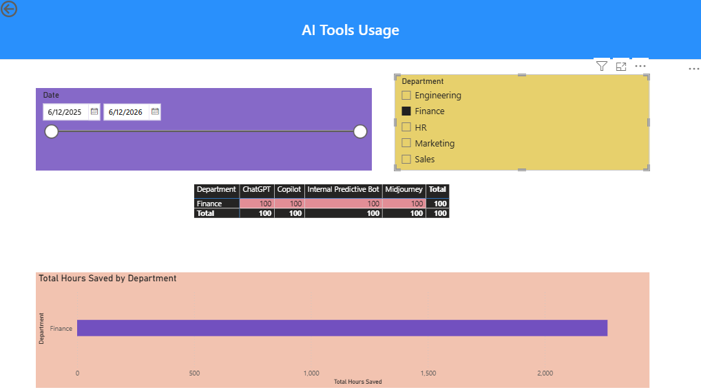
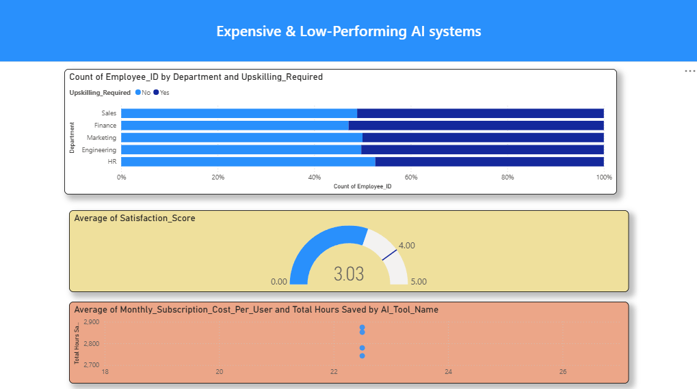

# Enterprise AI Adoption & ROI Optimization Dashboard

## 📊 Project Overview
This Power BI dashboard provides data-driven insights into how a modern enterprise utilizes Artificial Intelligence tools across various business departments. The goal is to track employee adoption, evaluate productivity gains (hours saved), and analyze the financial Return on Investment (ROI) of integrated AI tools.

## 💡 Key Business Questions Answered
- Which departments are successfully adopting AI tools, and where is adoption lagging?
- What is the net financial impact of AI tool subscriptions vs. human hours saved?
- Which AI tools deliver the highest value relative to their license costs?

## 🛠️ Tech Stack & Skills Demonstrated
- **Power BI Desktop:** Dashboard design and architecture.
- **Power Query:** ETL processes, data cleaning, and data profiling.
- **DAX (Data Analysis Expressions):** Advanced time intelligence and financial measures (ROI, Cumulative Hours Saved).
- **Data Modeling:** Star schema architecture connecting usage logs, financial data, and sentiment surveys.

## 📈 Dashboard Preview

*Figure 1: Executive Summary Page showing overall organizational ROI.*

*Figure 2: Department and Employee Adoption Analysis.*

*Figure 2: Tool Performance & Sentiment Analysis.*

## ⚙️ Project Architecture & Pipeline
1. **Data Engineering:** Cleaned raw system logs, handled missing values, and verified data types in Power Query.
2. **Modeling:** Established proper normalized relationships between dimensions and fact tables using a Star Schema.
3. **DAX Development:** Created customized measures for organizational efficiency and financial impacts.
4. **UI/UX Design:** Applied professional design layouts, prioritizing a scannable narrative flow and intuitive filtering.

## 🚀 How to Run This Project
1. Download the `AI_Usage_Dashboard.pbix` file from this repository.
2. Install [Power BI Desktop](https://powerbi.microsoft.com/).
3. Open the file to interact with the visual filters and explore the underlying data model.
